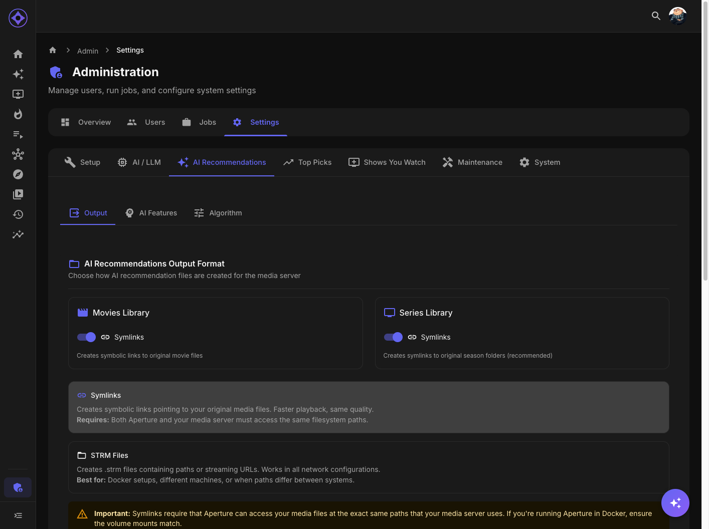

# Output Format Configuration

Choose how Aperture's libraries physically appear on disk: **symlinks** or **STRM files** — per media type — or switch those libraries off altogether.

## Legacy library output

The per-viewer **AI Picks** libraries and the shared **Top Picks** libraries (with the Top Picks collection and playlist built from them) are **legacy output**, being phased out in favour of Emby home rows (Admin → Recommendations → Emby Home Rows). The card at the top of this page switches them off:

- **Off** stops every write at once: the library jobs record a skipped run, nothing new is created, and the settings that only concern these libraries — this page's format switches, [File locations](file-locations.md), [Library naming](library-titles.md), the Top Picks output card — are greyed out but kept.
- **Frozen libraries still follow permissions.** They play the original files, so the library jobs keep checking them while the output is off: a viewer who loses access to a library (or whose parental ceiling drops) loses their frozen AI Picks library at the next library sync, and the frozen Top Picks library is withdrawn from accounts that may no longer open where its titles came from. Libraries written before this check existed cannot prove what they hold, so a restricted viewer's goes the first time; an unrestricted viewer's stays.
- **Libraries already in the media server are left alone** until you press **Remove generated libraries** (only available while the output is off). That runs the `remove-legacy-libraries` job: it deletes every generated library — recorded ones and ones an earlier library-name change left behind, found by the folder they read — their folders under `/aperture-libraries`, and the Top Picks collection and playlist (only if they hold nothing but Top Picks titles). A library the media server refuses to delete is kept and can be retried.
- **New installs start with it off**; an instance that already made libraries keeps it on until you change it.

## Accessing Settings

Admin console → **Recommendations** → **Output format** (`/admin/recommendations/output`). [Top Picks](top-picks.md) has its own per-output switches.

## Symlinks vs STRM

| | **Symlinks** (default, recommended) | **STRM files** |
|---|---|---|
| What's on disk | A real filesystem link to your original file | A tiny text file containing the path/URL of the real media |
| Playback | Native — the server plays the original | The server follows the pointer at play time |
| Requirements | Aperture and the media server must **share the volume** with aligned paths ([File locations](file-locations.md)) | Only that the server can read the target path |
| Watch out for | Windows without symlink privilege; cross-device mounts | Transcoding/subtitle edge cases on some clients |

The UI actively recommends **symlinks for series** (per-season folder structures behave best), warns about symlink pitfalls on the relevant platforms, and recommends **STRM for Windows Docker Desktop** deployments ([full guide](windows-docker-desktop.md)). If symlink creation fails at runtime, the writer **falls back to STRM automatically** rather than failing the build.

Both default to **symlinks** for movies and series — the "movies default to STRM" claim in older docs was backwards.

## What's Automatic (No Switch)

NFO sidecars are always written alongside items: the per-user **AI explanation** in the `<plot>` (where enabled, with the instance-name credit line), **rank-based sort titles** so shelves order by recommendation rank, real **IMDb/TMDB `uniqueid`s**, and `lockdata` so your media server doesn't overwrite the metadata.

## Paths

Aperture always writes to `/aperture-libraries` inside its own container. What you configure is the **media-server-side** path — see [File locations](file-locations.md), whose **Auto-Detect Paths** button computes the mapping from a sample file.

## Troubleshooting

- **Libraries build but items won't play** — STRM targets unreachable from the server; check the path prefix mapping
- **Symlink creation errors in job logs** — privilege or mount issues; the writer fell back to STRM, or fix the volume mounts
- **Switched formats and old items linger** — format changes apply to newly written items; run the library jobs and remove stale server libraries by hand

---

**Related:** [File locations](file-locations.md) · [Library title templates](library-titles.md) · [Windows Docker Desktop](windows-docker-desktop.md)
