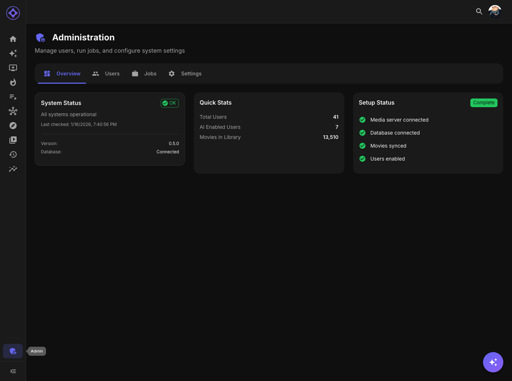

# Setup Wizard

The Setup Wizard guides initial Aperture configuration in 8 steps. It appears automatically on first access (from local-network addresses only) and can be re-run at any time via the **Re-run Setup Wizard** button pinned to the bottom of the admin nav column.

## Before You Start

Have ready: your media server's URL and **API key** (Emby: Dashboard → Advanced → API Keys; Jellyfin: Dashboard → API Keys) and an **AI provider API key** (the wizard requires one — OpenAI is the default suggestion, but every provider catalog is offered).

First-run access is **restricted to local-network addresses** until setup completes, so connecting from the server's own machine or LAN is expected. Admins re-running the wizard get an **exit button** so they can back out without changes; nothing is overwritten until you pass through a step, and returning to a re-run shows your current settings pre-filled.

## The 8 Steps

### 1. Restore

Optionally restore a [backup](backup-restore.md) from a previous instance instead of starting fresh — the fastest migration path. Skip to configure from scratch.

### 2. Connect

Media server **type** (Emby/Jellyfin), **URL**, and **API key**, plus:

- **Discover Servers on Network** — UDP auto-discovery of Emby/Jellyfin instances on the LAN
- **Allow passwordless login** — only for media servers that permit passwordless accounts; carries an exposure warning (see [Media server](media-server.md))

**Test** verifies the credentials and shows the resolved server name.

### 3. Libraries

Per-library **enable switches** fetched from your server, grouped **Movies / TV**. Bulk controls — **Refresh**, **Enable All**, **Disable All** — live right here in the wizard. Everything disabled is invisible to Aperture (see [Libraries](libraries.md)).

> **No paths, output format or mount checks.** Earlier versions asked here where to write STRM/symlink libraries, which format to use, and then validated the `/aperture-libraries` and `/media` mounts. That output is legacy and a **new install starts with it switched off** — recommendations are read in the app and, on Emby, shown as home rows (Admin → Recommendations → Emby Home Rows). An operator who still wants the libraries switches them on in [Output format](output-format.md) and sets [File locations](file-locations.md) there.

### 4. Users

Import and enable users, toggling **Movies / Series** per user. The wizard **refuses to disable the last enabled admin**. Users can also be managed later (see [User management](user-management.md)).

### 5. Top Picks

One switch: enable [Top Picks](top-picks.md). Sources, windows and auto-request are configured on the Top Picks admin page afterwards, as is its legacy library / collection / playlist output.

### 6. AI / LLM

**Mandatory** — the wizard will not finish without it. Four roles must each have a provider, model, and key configured: **Embeddings**, **Chat**, **Text Generation**, and **Exploration**. The step renders as per-role cards (the same ones as [Providers & roles](ai-providers.md)); Continue stays disabled until all four are valid.

### 7. Initial Jobs

The wizard queues the kickoff pipeline — **8 jobs**: library syncs (movies, series), **watch-history syncs** (deliberately before embeddings), movie/series **embeddings** and movie/series **recommendations**. The library builds and the Top Picks refresh are no longer part of it; both are legacy output. This means **recommendations already exist when the wizard finishes** — there is no separate "generate recommendations" step afterwards. Watch the jobs console if you want to see it work ([Jobs overview](jobs-overview.md)).

### 8. Done

What to do next — sign in to see recommendations, and on Emby put them on home screens (Admin → Recommendations → Emby Home Rows) — the schedules that were set, and which features just unlocked. From here, the [Post-setup checklist](post-setup-checklist.md) takes over.

---

**Related:** [Media server](media-server.md) · [AI providers](ai-providers.md) · [Post-setup checklist](post-setup-checklist.md)
